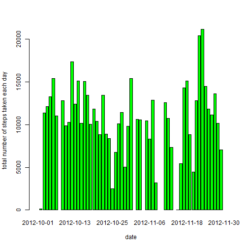

# Reproducible Research: Peer Assessment 1


## Loading and preprocessing the data

```r
data <- read.csv("activity.csv")
```
Remove all NA value and store it in new object, data2 

```r
good <- complete.cases(data)
data2 <- data[good, ]
```
## What is mean total number of steps taken per day?
First sum all steps per date using tapply
and then make frequency table in data.frame format

```r
sum.step <- with(data2, tapply(data2$steps, data2$date, sum))
data.hist <- data.frame("date"=strptime(names(sum.step),"%Y-%m-%d"),
                        "steps"=sum.step, row.names=NULL)
```
plot barplot

```r
with(data.hist, barplot(steps, names=date, xlab="date",
                        ylab="total number of steps taken each day", col="green"))
```

 

Get mean total number of steps per day using result from tapply

```r
mean.day <- mean(sum.step, na.rm=TRUE)
mean.day
```

```
## [1] 10766
```
Get median in same way

```r
median.day <- median(sum.step, na.rm=TRUE)
median.day
```

```
## [1] 10765
```

## What is the average daily activity pattern?
To get mean of steps per interval, data set is sorted in order of interval

```r
#function to sort ang get mean for steps according to interval
sortANDgetmean <- function(data){
        data.order <- order(data$interval)
        data.sorted <- data[data.order, ]
        mean <- with(data.sorted, tapply(data.sorted$steps, data.sorted$interval, mean))
        mean
}
```
result is plotted

```r
mean.step <- sortANDgetmean(data2)
plot(names(mean.step), mean.step, type="l",
     xlab="5-minute interval", ylab="average number of steps")
```

 

## Imputing missing values
First couting number of NA value

```r
NA.row <- is.na(data)
NA.row2 <- NA.row[NA.row[,1]==TRUE,]
length(NA.row2[,1])
```

```
## [1] 2304
```
missing values are replaced with average of steps per interval, using pre-calculated result

```r
data3 <- data
for(i in 1:length(data3[,1])) {
        
        if(is.na(data3[i,1])){
                flag <- as.character(data3[i,"interval"])
                #fill missing value with mean for 5-minute value
                data3[i,1] <- mean.step[flag]
        }
}
```
plot barplot

```r
sum.step2 <- with(data3, tapply(data3$steps, data3$date, sum))
data.hist2 <- data.frame("date"=strptime(names(sum.step2),"%Y-%m-%d"),
                        "steps"=sum.step2, row.names=NULL)
with(data.hist2, barplot(steps, names=date, xlab="data",
                   ylab="total number of steps taken each day", col="red"))
```

 

Get mean

```r
mean.day2 <- mean(sum.step2)
mean.day2
```

```
## [1] 10766
```
Get median

```r
median.day2 <- median(sum.step2)
median.day2
```

```
## [1] 10766
```
result is slightly different from above
## Are there differences in activity patterns between weekdays and weekends?
First separate data set based on the day
In my system, day is presented in Korean
so, I used some Korean word for day in this code

```r
data.factor <- factor(c("weekday","weekend"))
data3$date <- strptime(data3$date, "%Y-%m-%d")
week <- weekdays(data3$date, abb=TRUE)
for(i in 1:length(week)) {
        if(week[i] == "Åä")
                week[i] <- data.factor[2]
        else if(week[i]== "ÀÏ")
                week[i] <- data.factor[2]
        else
                week[i] <- data.factor[1]
}
```
Combine day information to data set
and divide data frame to calculate average step for weekday and for weekend

```r
data4 <- data.frame(data3, "day"=week)

data.weekday <- data4[data4$day==1,]
data.weekend <- data4[data4$day==2,]

weekday.step <- sortANDgetmean(data.weekday)
weekend.step <- sortANDgetmean(data.weekend)
```
make data frame for weekday and weekend
and combine it

```r
data4 <- data.frame("interval"=as.numeric(names(weekday.step)), "steps"=weekday.step,
                    "day"=data.factor[1], row.names=NULL)
data5 <- data.frame("interval"=as.numeric(names(weekend.step)), "steps"=weekend.step,
                    "day"=data.factor[2], row.names=NULL)
total.data <- rbind(data4, data5)
```
plot using lattice

```r
library(lattice)
xyplot(steps~interval | day, data=total.data, layout=c(1,2), type="l",
       xlab="Interval", ylab="Number of steps")
```

 
